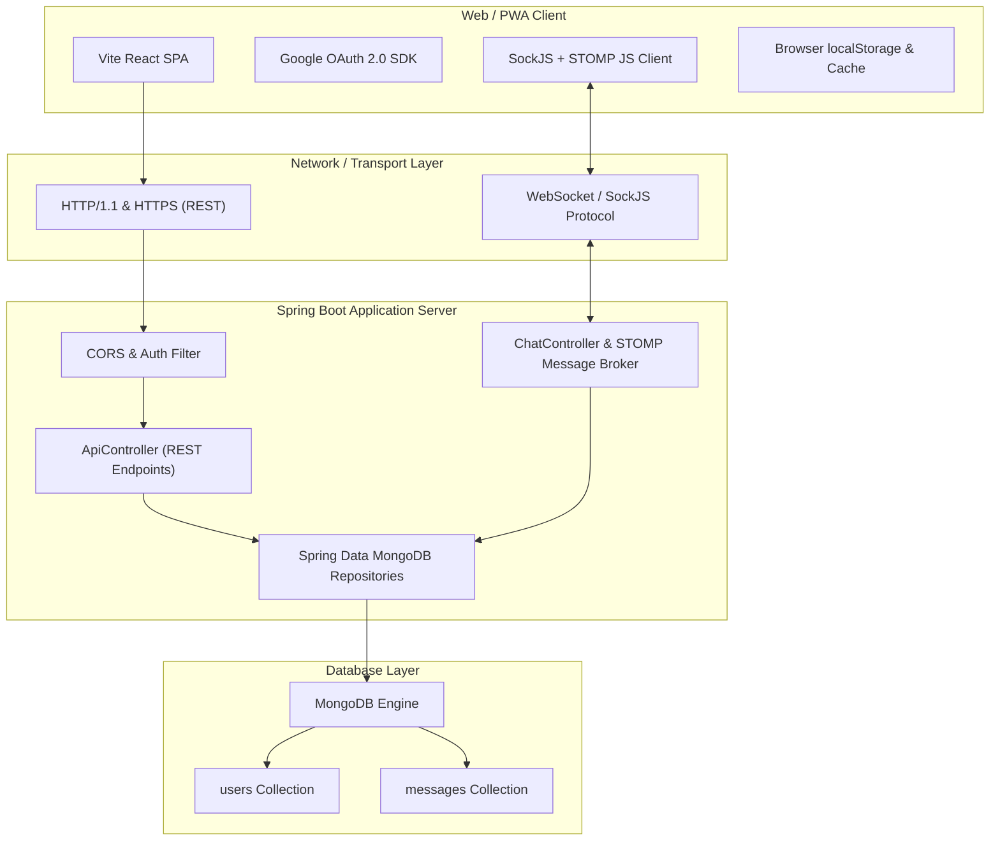
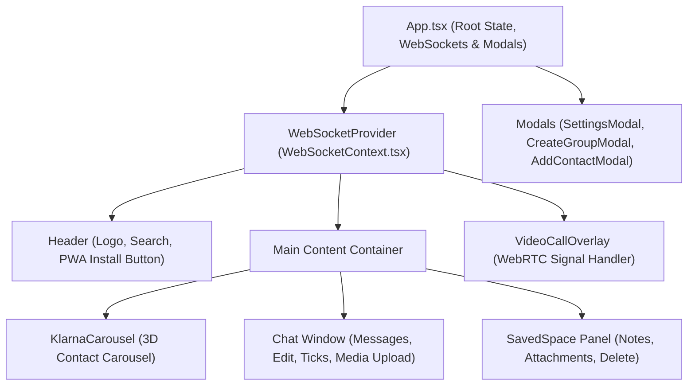
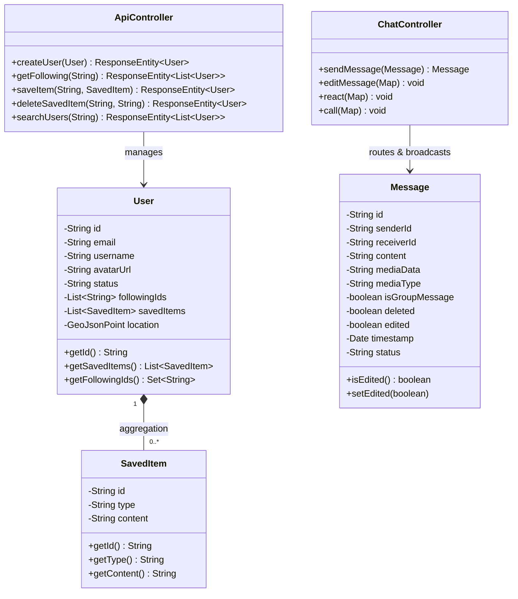

# 📐 NexusChat — System Design & Architecture Document (HLD / LLD)

This document provides the in-depth architectural blueprint, High-Level Design (HLD), Low-Level Design (LLD), component hierarchies, and REST/WebSocket specifications for **NexusChat**.

---

## 1. High-Level Design (HLD)

### 1.1 Architectural Style & Patterns
NexusChat follows a **Full-Stack Event-Driven Client-Server Architecture** utilizing:
- **Single Page Application (SPA / PWA)**: Client-side routing and rendering via React 18 and Vite.
- **Micro-Kernel / Service Oriented Backend**: Java Spring Boot 3.x providing modular REST APIs and a Stomp/SockJS WebSocket message broker.
- **Document-Oriented Database**: MongoDB with geospatial indexing (`2dsphere`) for flexible schema evolution and location-based queries.

### 1.2 HLD Architecture Diagram

---

## 2. Low-Level Design (LLD)

### 2.1 React Component Hierarchy & State Flow

---

### 2.2 Class & Entity Design (Domain Model)

---

## 3. Communication Specifications

### 3.1 REST API Reference (HTTP)
| Method | Endpoint | Description |
| :--- | :--- | :--- |
| `POST` | `/api/users` | Creates or updates a Google-authenticated user |
| `GET` | `/api/users/{userId}/following` | Retrieves persisted list of followed contacts |
| `POST` | `/api/users/{userId}/saved-items` | Saves a text note, image, or PDF attachment |
| `DELETE` | `/api/users/{userId}/saved-items/{itemId}` | Deletes a saved item by UUID |
| `GET` | `/api/users/search?query={q}` | Case-insensitive search across username/email |
| `GET` | `/api/users/nearby?lat={l}&lng={g}` | Returns nearby users using MongoDB `2dsphere` index |
| `GET` | `/api/messages/{userId}/{contactId}` | Loads historical chat history between two users |

---

### 3.2 WebSocket STOMP Topics & Queues
| Destination (`/app`) | Subscribe Topic (`/topic`) | Purpose |
| :--- | :--- | :--- |
| `/app/chat.sendMessage` | `/topic/user.{userId}` | Sends and delivers 1-on-1 direct messages |
| `/app/chat.sendMessage` | `/topic/group.{groupId}` | Broadcasts group messages to all subscribers |
| `/app/chat.editMessage` | `/topic/user.{userId}` | Broadcasts edited message updates in real time |
| `/app/chat.call` | `/topic/call.{userId}` | Transmits WebRTC signaling frames (Offer/Answer/Candidate) |

---

## 4. Security & Error Handling Strategies

1. **Duplicate Account Prevention**:
   - When `/api/users` is called on login, the `ApiController` scans for existing users by email before saving. If found, it updates the profile instead of generating duplicate UUIDs.
2. **Media Payload Handling**:
   - Image and document uploads to *Saved Space* or *Chat* are encoded as Base64 strings or stored in MongoDB. Large payloads are guarded by Spring Boot `max-file-size` configuration.
3. **Autoplay Audio Mitigation**:
   - Modern browsers block notification chimes if the tab has no user interaction. NexusChat implements fallback visual **Toast Notifications** that slide in regardless of audio policy.
