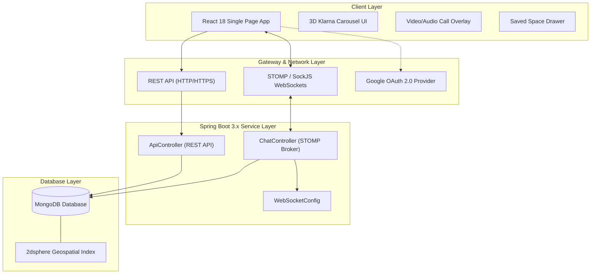
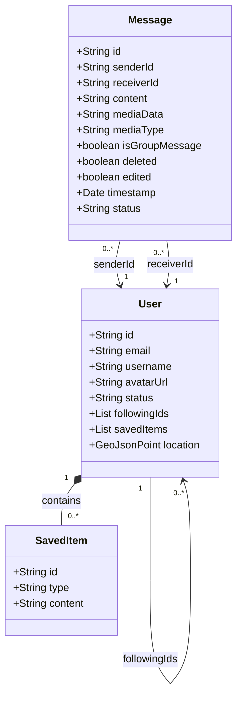
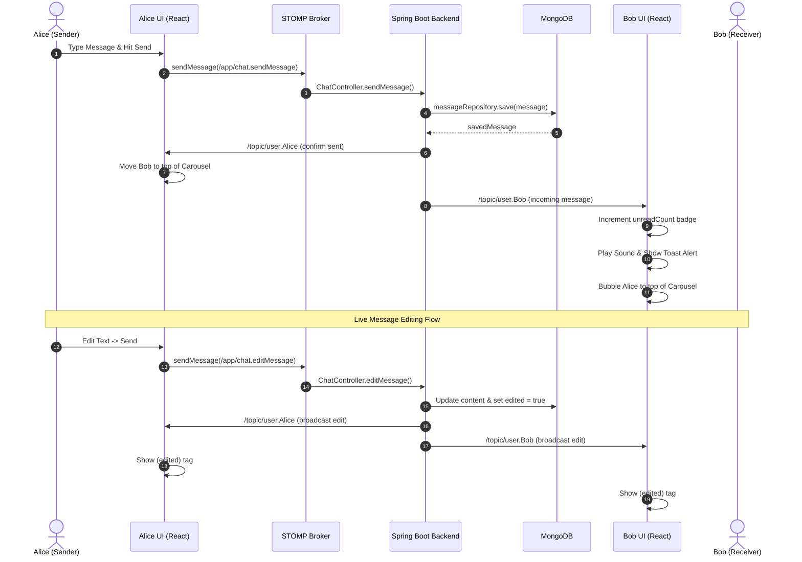

# 🌐 NexusChat — Next-Generation Real-Time Full-Stack Messaging & PWA Platform

<div align="center">
  <h3>A modern, real-time collaboration & messaging platform featuring an interactive 3D Circular Carousel UI, live STOMP WebSockets, rich media Saved Space, and voice/video WebRTC signaling.</h3>
  
  [](https://reactjs.org/)
  [](https://www.typescriptlang.org/)
  [](https://vitejs.dev/)
  [](https://spring.io/projects/spring-boot)
  [](https://www.mongodb.com/)
  [](https://web.dev/progressive-web-apps/)
</div>

---

<div align="center">
  
  <p><i>NexusChat — Featuring 3D Orbital Contact Carousel, Glassmorphic Live Chat, and WebRTC Call Signaling</i></p>
</div>

### 🎯 Quick Feature Jump (Click to Explore)
<div align="center">
  <a href="#1--3d-klarna-circular-carousel-workspace"><b>🌀 3D Carousel UI</b></a> •
  <a href="#2--real-time-stomp--websockets-messaging"><b>⚡ Live STOMP WebSockets</b></a> •
  <a href="#3--google-oauth-20--smart-account-management"><b>🔐 Google Auth 2.0</b></a> •
  <a href="#4--advanced-saved-space-personal-workspace"><b>💾 Saved Space (Attachments)</b></a> •
  <a href="#5--webrtc-call-signaling--presence"><b>📞 WebRTC Signaling</b></a> •
  <a href="#6--progressive-web-app-pwa--responsive-design"><b>📱 PWA Ready</b></a>
</div>

---

## ✨ Comprehensive Features List

### 1. 🌀 **3D Klarna Circular Carousel Workspace**
- **Spatial UI**: Built with Framer Motion and 3D trigonometry transformations to render contacts and groups as interactive rotating orbital nodes.
- **Dynamic WhatsApp-Style Sorting**: Whenever a new message is sent or received, the active contact automatically bubbles to the top/front of the carousel.
- **Unread Notification Badges**: Distinct red numerical badges dynamically overlay contact avatars when unread messages arrive from background conversations.
- **Instant Follow Integration**: Searching and following contacts immediately injects them into the active Carousel.

### 2. ⚡ **Real-Time STOMP & WebSockets Messaging**
- **Instant Delivery**: Full bidirectional messaging over Spring Boot STOMP/SockJS WebSockets without polling.
- **Live Read Receipts**: Interactive message ticks (`✓` Sent, `✓✓` Delivered, and **Blue Tick** Read statuses).
- **Microsoft Teams-Style Message Editing**: Inline message editing with live WebSocket re-broadcasting and a subtle `(edited)` tag on updated messages.
- **Unsend / Deletion**: Delete messages in real time for both sender and receiver.

### 3. 🔐 **Google OAuth 2.0 & Smart Account Management**
- **One-Click Authentication**: Integrated `@react-oauth/google` for seamless Google OAuth 2.0 social sign-in.
- **Duplicate Prevention Engine**: Automatically detects existing users by email/username on login, preventing redundant database records and synchronizing avatar updates.
- **Session & Avatar Persistence**: Maintains custom avatars and authentication state securely in `localStorage` across reloads.

### 4. 💾 **Advanced "Saved Space" Personal Workspace**
- **Multi-Modal Storage**: Bookmark important messages, write custom text reminders, or upload **Images and Documents** directly into your personal repository.
- **In-Memory & Persistent Storage**: Stored as structured `SavedItem` MongoDB objects with unique UUIDs, timestamps, and media type tags (`TEXT`, `IMAGE`, `PDF`).
- **One-Click Deletion**: Dedicated trash controls for purging obsolete items.

### 5. 📞 **WebRTC Call Signaling & Presence**
- **Voice & Video Signaling**: Integrated calling overlay capable of transmitting call invites and answering signals over dedicated STOMP user channels (`/topic/call.{userId}`).
- **Live Presence Indicators**: Real-time "Online" status dots and activity headers.

### 6. 📱 **Progressive Web App (PWA) & Responsive Design**
- **Native Installability**: Features an interactive **"Download App"** header button utilizing the browser's native `beforeinstallprompt` API to install NexusChat to desktop or mobile home screens.
- **Mobile-First Layout**: Adaptive CSS breakpoints that smoothly transform the 3D Carousel and Saved Space into full-screen mobile drawers (`max-width: 768px`).
- **Visual Toast Notifications**: Slide-in toast alerts to notify users of incoming messages when browser autoplay audio policies block audio chimes.

---

## 🏛️ High-Level Design (HLD)

The High-Level Architecture separates the client-side presentation layer from the Spring Boot service layer, communicating via REST over HTTP and bidirectional STOMP WebSockets over SockJS.



---

## 🔬 Low-Level Design (LLD)

### 1. **Entity Relationship & Domain Schema**
Below is the MongoDB data model showing the relationship between `User`, `Message`, and `SavedItem`.



---

### 2. **Real-Time STOMP & Notification Sequence Flow**
This sequence diagram illustrates how a message is sent, edited, and broadcasted, triggering unread badges and audio/toast notifications on the recipient's UI.



---

## 🚀 Getting Started & Setup Instructions

### Prerequisites
- **Java 17+** and **Maven 3.8+**
- **Node.js 18+** and **npm / pnpm**
- **MongoDB 6.0+** running locally on default port `27017`

### 1. Start the Spring Boot Backend
```bash
cd backend
# Build and run the backend server (runs on http://localhost:8080)
mvn spring-boot:run
```
*Note: The backend automatically initializes and seeds default mock contacts on startup if the database is empty.*

### 2. Start the Frontend React (Vite) App
```bash
cd frontend
# Install dependencies
npm install

# Start the Vite development server (runs on http://localhost:5173)
npm run dev
```

### 3. Build for Production / PWA
```bash
cd frontend
npm run build
```

---

## 🔒 Security & Privacy Notice
- No hardcoded OAuth client secrets or database credentials are stored in public files.
- Ensure your production Google OAuth Client IDs are configured via environment variables (`VITE_GOOGLE_CLIENT_ID`).

---

<div align="center">
  <p>Built with ❤️ using Spring Boot, React, and MongoDB.</p>
</div>
